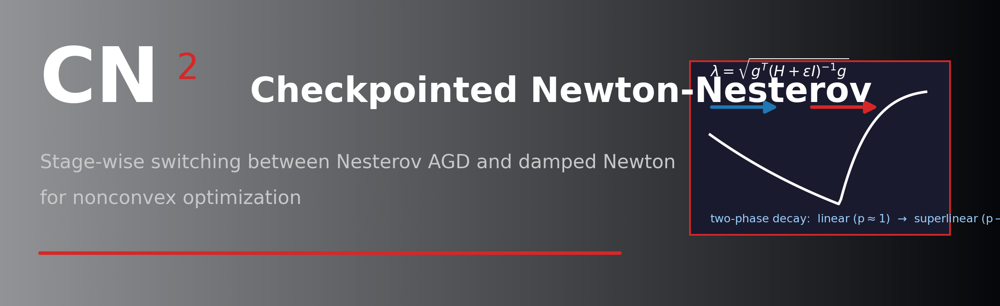

<p align="center">
  
</p>

# CN² — Checkpointed Newton-Nesterov

Stage-wise hybrid optimization for smooth nonconvex objectives, alternating
short phases of **damped Newton** (fresh Hessian per step) with phases of
**Nesterov accelerated gradient** under a single phase-switching threshold
(the Newton decrement λ), plus a dual gate for the nonconvex regime.

All methods are implemented **from scratch in NumPy** — no SciPy — and track
exact evaluation counts (f / gradient / Hessian) so that Hessian economy is
benchmarked fairly against classic baselines.

```
[ Newton x2 ] -- monitor λ -->  λ ≤ τ ? stop
     | λ > τ  -->  [ Nesterov AGD until λ ≤ τ ] --> back to Newton
```

## Core idea

Each "checkpointed" cycle runs two damped Newton steps (fresh Hessian each),
then evaluates the **Newton decrement** λ = sqrt(gᵀ(H+μI)⁻¹g):

- if λ ≤ τ → done (superlinear local convergence)
- otherwise → run **Nesterov AGD** until λ drops to τ (fast long-range
  progress / nonconvex escape), then return to Newton (checkpoint).

**Dual gate:** when H is not positive-definite (nonconvex region) the
decrement λ is invalid, so gradient norm ‖g‖ drives the phase switch instead.
In convex/strictly-convex regions λ governs switching.

## Results (highlights, corrected live-run)

| Problem | CN² Hessians | Newton Hessians | f_CN² | f_Newton |
|---|---|---|---|---|
| Rosenbrock n=100 | 262 | 163 | **0.0** | 2.1e-22 |
| Rosenbrock n=200 | ~179 | 300 (fails) | **0.0** | **0.51 ✗** |
| Beale (2D) | 21 | — | **1.6e-22** | 14.0 ✗ |

Two-phase contraction of λ: a slow linear regime (Nesterov, exponent p≈1)
followed by a superlinear regime (Newton, p>1) — the engine of the method.

## Repository layout

```
src/core.py                  CN² + Nesterov + Newton (manual NumPy)
benchmarks/baselines.py      GD, Newton-CG, L-BFGS, NAG (manual)
problems/test_funcs.py       Rosenbrock, QuadIllCond, Beale, Himmelblau, Logistic
experiments/run_all.py       full benchmark + 6 figures
experiments/export_tables.py 7 CSV result tables
tests/                       smoke + validation tests
paper/                       LaTeX draft (EN + AR), PDFs
notes/                       reproducibility notes
results/                     benchmark.json + CSV tables
figures/                     figures (also copied to paper/figures)
```

## Run the benchmark

```bash
python experiments/run_all.py     # validates + full comparison + sensitivity + plots
python experiments/export_tables.py  # writes results/table_*.csv
python tests/run_cn2_dualgate.py     # smoke test across problems
```

Requires only **NumPy** and **matplotlib** (Python ≥ 3.10). LaTeX (MiKTeX
/TeX Live) needed only to rebuild the paper PDFs.

## Publication target

SIAM Journal on Optimization and/or NeurIPS. Theoretical manuscript
(`chen23` step-sequence analysis) in `paper/`.

## License

MIT — see [LICENSE](LICENSE).